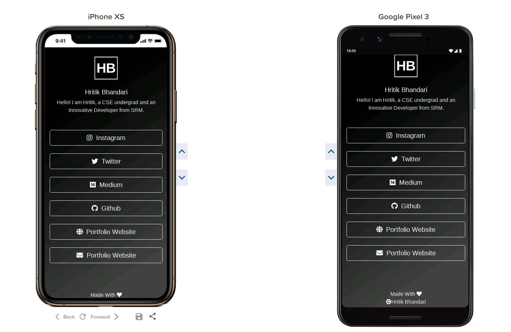

[![LinkedIn][linkedin-shield]][linkedin-url]


<!-- PROJECT LOGO -->
<br />
<p align="center">
  <a href="https://github.com/hritikbhandari/Custom-Linktree-Template">
    
  </a>

  <h3 align="center">Custom Linktree Template</h3>

  <p align="center">
    Create your own Custom Linktree with all your social and business handles using this Bootstrap based HTML Template.
    <br />
    <a href="https://github.com/hritikbhandari/Custom-Linktree-Template"><strong>Explore the docs »</strong></a>
    <br />
    <br />
    <a href="https://hritikbhandari.github.io/Custom-Linktree-Template/">View Demo</a>
    ·
    <a href="https://github.com/hritikbhandari/Custom-Linktree-Template/issues">Custom-Linktree-Templatert Bug</a>
    
  </p>
</p>


<!-- TABLE OF CONTENTS -->
## Table of Contents

- [Table of Contents](#table-of-contents)
- [About The Project](#about-the-project)
  - [Built With](#built-with)
- [Getting Started](#getting-started)
  - [Installation](#installation)
- [Usage](#usage)
- [Contributing](#contributing)
- [License](#license)
- [Acknowledgements](#acknowledgements)


<!-- ABOUT THE PROJECT -->
## About The Project



We all have heard about Linktree (linktr.ee) and how it generates single mobile pages containing all the social and professional handles of an individual or an organization. 

So, this is a simple template with which you can generate your own Linktree with all your handles and use it platforms like <strong> Instagram, Twitter etc.</strong>


### Built With

* [HTML]()
* [CSS]()
* [Bootstrap 4]()


<!-- GETTING STARTED -->
## Getting Started

To get a local copy up and running follow these simple steps.


### Installation
 
1. Clone this repo [Custom-Linktree-Template]
```sh
git clone https://github.com/hritikbhandari/Custom-Linktree-Template.git
```

or simply use the Clone button on the Github UI and download the zip file.


<!-- USAGE EXAMPLES -->
## Usage

Simply replace the given handles with your own and add or replace icons using fontawesome.

_For more examples, please refer to the [Documentation](https://getbootstrap.com)_


<!-- CONTRIBUTING -->
## Contributing

Contributions are what make the open source community such an amazing place to be learn, inspire, and create. Any contributions you make are **greatly appreciated**.

1. Fork the Repo.
2. Create your Feature Branch (`git checkout -b feature/AmazingFeature`)
3. Commit your Changes (`git commit -m 'Add some AmazingFeature'`)
4. Push to the Branch (`git push origin feature/AmazingFeature`)
5. Open a Pull Request


<!-- LICENSE -->
## License

Distributed under the MIT License. See `LICENSE` for more information.


<!-- ACKNOWLEDGEMENTS -->
## Acknowledgements
* [Bootstrap 4]()
* [Font Awesome]()


<!-- MARKDOWN LINKS & IMAGES -->
<!-- https://www.markdownguide.org/basic-syntax/#reference-style-links -->


[linkedin-shield]: https://img.shields.io/badge/-LinkedIn-black.svg?style=flat-square&logo=linkedin&colorB=555
[linkedin-url]: https://linkedin.com/in/hritikbhandari
